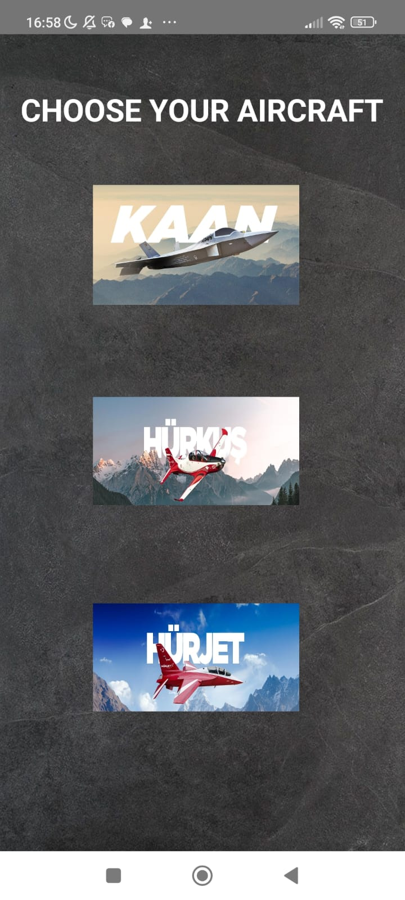
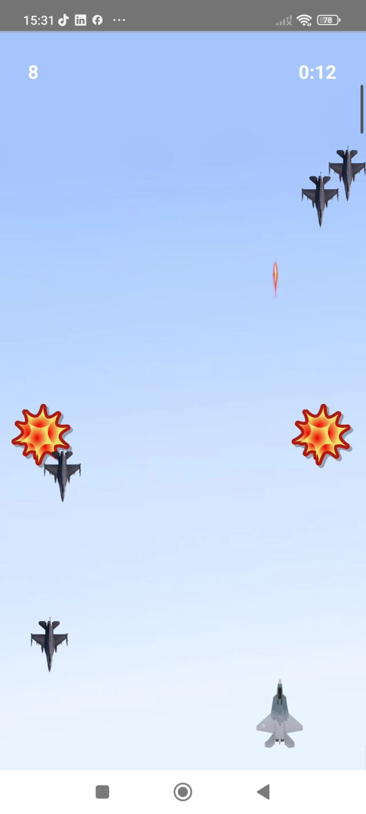

# Aerial Defence Game – Türk Savaş Uçakları ile Mobil Hava Savunma Oyunu

## ✈️ Proje Tanımı (Türkçe)

**Aerial Defence Game**, TUSAŞ (Türk Havacılık ve Uzay Sanayii) tarafından geliştirilen ileri seviye savaş uçakları olan **KAAN**, **HÜRJET** ve **HÜRKUŞ-C** modellerinin yer aldığı, mobil cihazlara özel olarak geliştirilen bir hava savunma oyunudur.

Bu oyun, **Clomosy oyun geliştirme platformunda**, nesne yönelimli yapı destekleyen **TRObject programlama dili** ile geliştirilmiştir. Gerçek zamanlı kontrol, düşman üretimi, ses efektleri ve dinamik oyun döngüsü gibi ileri seviye birçok mekanik entegre edilmiştir.

  
  
  

### 🎯 Temel Özellikler
- **Uçak Seçimi:** KAAN, HÜRJET, HÜRKUŞ-C gibi TUSAŞ üretimi jetlerden seçim.  
- **Gerçek Zamanlı Kontrol:** Butonlarla yön kontrolü.  
- **Hedef Vurma:** Füze atışı ve çarpışma tespiti ile düşman etkisiz hale getirme.  
- **Dinamik Düşmanlar:** Ekranda üstten rastgele düşman jetlerinin oluşturulması.  
- **Ses Efektleri:** Her koşula uygun sesler (ateş, patlama, ortam).  

### 🛠️ Geliştirme Ortamı
- Platform: **Clomosy Game Editor**  
- Dil: **TRObject (Clomosy Script Dili)**  
- Hedef: **Mobil Cihazlar (Android/iOS)**  

---

# Aerial Defence Game – Mobile Air Combat with Turkish Fighter Jets

## ✈️ Project Description (English)

**Aerial Defence Game** is a mobile air combat project that features advanced Turkish military jets—**KAAN**, **HÜRJET**, and **HÜRKUŞ-C**—all developed by **TUSAŞ (Turkish Aerospace Industries)**. The player selects a fighter jet and intercepts randomly spawned enemy aircraft using real-time controls.

This project is built on the **Clomosy game development platform**, using the **TRObject programming language**, a C-style, object-oriented scripting language optimized for mobile environments. The system includes dynamic enemy spawning, audio effects, and a dynamic game loop with advanced mechanics.

### 🎯 Key Features
- **Aircraft Selection:** Choose from TUSAŞ-developed jets: KAAN, HÜRJET, HÜRKUŞ-C.  
- **Motion Sensor Steering:** Control the aircraft using right and left buttons.  
- **Target Locking & Shooting:** Launch missiles to intercept enemy jets.  
- **Enemy Spawning System:** Randomized enemy aircraft appear and descend from the top of the screen.  
- **Audio System:** Custom sounds for firing, explosions, and ambient effects.  

### 🛠️ Development Details
- Engine: **Clomosy Game Editor**  
- Language: **TRObject (Clomosy Scripting Language)**  
- Platform: **Mobile Devices (Android/iOS)**  

---

